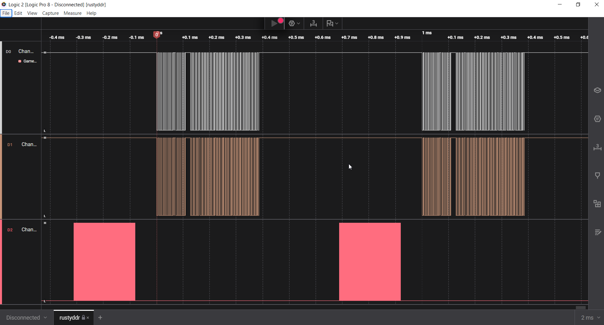
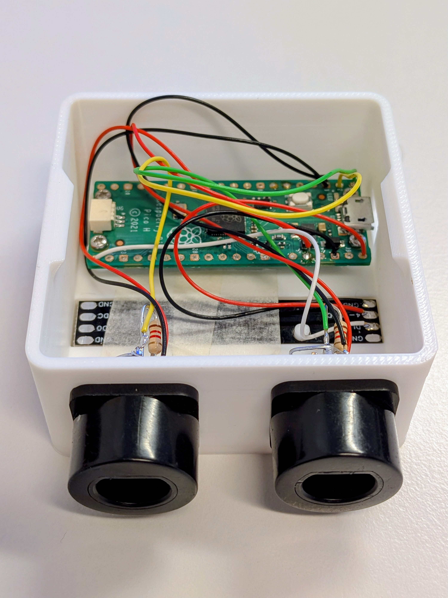
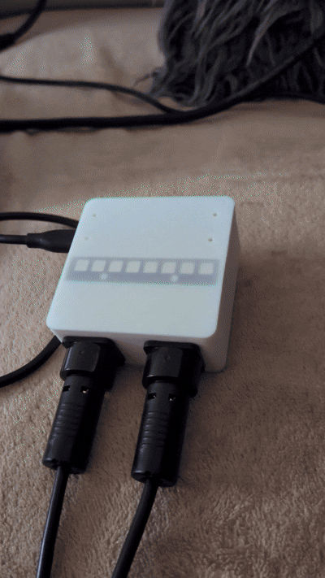

# 🕺 RustyDDR: Pro-Sync GameCube Adapter

  

## ⚡ Objective

Upcycle legacy Wii DDR Konami RU054 hardware for `StepMania`.

This project leverages the *RP2040 Raspberry Pico* and `embassy-rs` to eliminate input skew, ensuring perfectly synchronized sampling and zero-latency reporting.

## 🎯 Why This Matters (The Jitter Problem)

In high-level rhythm games like StepMania, a variance of even a few milliseconds can be the difference between a "Perfect" and a "Great" timing window. 

RustyDDR solves this at the hardware level. By leveraging the RP2040's PIO, both player mats are triggered to sample at the exact same clock cycle. 

## 🧠 System Architecture


*Above: Logic analyzer capture proving 1ms polling (1000Hz). D0 and D1 (Mats 1 & 2) are sampled simultaneously with zero skew. D2 shows the non-blocking LED update.*

* **Isochronous Sampling:** Hard-coded `poll_ms: 1` USB updates. A global main-loop trigger fires simultaneous PIO state machines for P1/P2, ensuring zero-skew, competitively fair input capture.
* **PIO-Driven LEDs:** LED logic utilizes a separate PIO block with merged TX FIFOs, allowing 8-LED WS2812B updates (P1 Green / P2 Blue) without stalling the main loop.
* **Composite HID:** Aggregates dual-mat inputs into a single 16-key USB gamepad interface.

## 🧰 Hardware



### Pinout

| RP2040 | Peripheral | Connection | Signal Type |
| :--- | :--- | :--- | :--- |
| **GP0** | PIO0 SM0 | Mat 1 Data | Open-Drain |
| **GP1** | PIO0 SM1 | Mat 2 Data | Open-Drain |
| **GP16** | PIO1 SM0 | WS2812 Data | DOUT |
| **VBUS** | Power | 5V Supply | LED Power |
| **3V3** | Power | 3.3V Logic | Mat Power |
| **GND** | Ground | Ground | Common |

> **Impedance Note:** Joybus is Open-Drain. While internal pull-ups function for short cable runs, external **1kΩ pull-ups** to 3.3V are strongly recommended for signal stability.

## ⚠️ Constraints

* **Dual-Mat Requirement:** Current logic expects two connected devices.
* **Handshake Blocking:** System may hang if a peripheral fails to reply during initialization (Watchdog/Timeout implementation pending).

## 🛠️ Deploy

### Option A: Binary (UF2)
1.  Hold **BOOTSEL** while connecting USB to mount as Mass Storage.
2.  Drop the latest release `.uf2` into the appeared drive to flash.

### Option B: Source (Cargo)

1.  **Clone:**
    ```bash
    git clone https://github.com/pchala/rustyddr.git
    cd rustyddr
    ```
2.  **Run (Probe-rs):**
    ```bash
    cargo run --release
    ```

## 📝 License

MIT License.

## In Action

